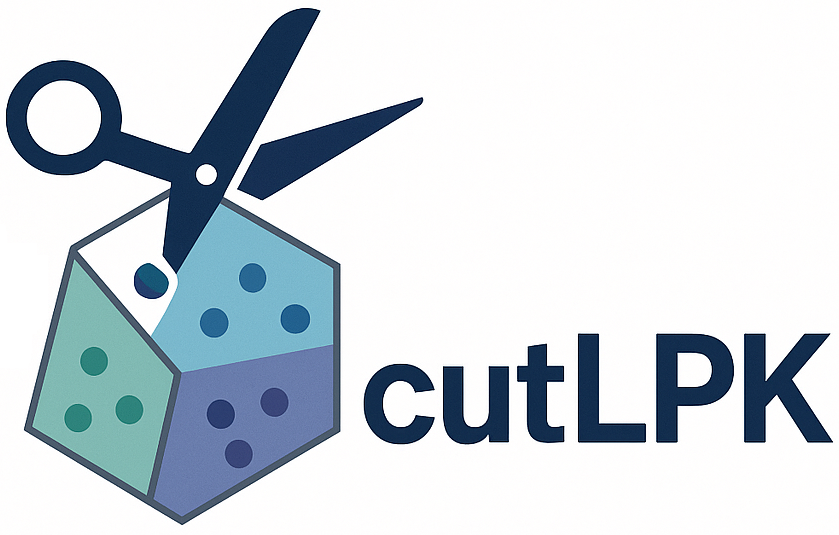

<p align="center">
  
</p>
A scalable linear programming framework for solving K-Means, Fair K-Means, and Spectral Clustering problems. This project implements a cutting-plane algorithm that utilizing and LP relaxation to solving clustering problems globally, as detailed in [arXiv preprint coming soon].

## Dependencies

This project relies on the following libraries. Versions used for testing are listed for reproducibility.

- **C++ Compiler**: A modern compiler supporting C++17.
- **CMake**: Version 3.16 or newer.
- **cuPDLP**: A high-performance CUDA-based LP solver. (Tested with CUDA 12.3) [cuPDLP GitHub Repository](https://github.com/COPT-Public/cuPDLP-C)
- **Gurobi**: Version 11.0 or newer. A Gurobi license is required. Free academic licenses are available.
- **Eigen**: Version 3.4 or newer. A C++ template library for linear algebra.
- **OpenMP**: For multi-threaded parallelism.

## Building the Project

The project uses CMake for configuration and building. Below are the steps to build the project:
1. Navigate to the project directory:
   ```bash
   cd path/to/cutLPK
   ```
2. Open the `config.cmake` file in a text editor and specify the dependency paths according to your system setup.
3. Create and enter a build directory:
   ```bash
   mkdir build
   cd build
   ```

4. Configure the project with CMake:
   ```bash
   cmake ..
   ```

5. Build the project:
   ```bash
   cmake --build
   ```

## Example Usage

All commands should be run from the `build` directory.

* **Ordinary K-Means Clustering**: Provide the data file and specify the number of clusters:

  ```bash
  ./cutLPK iris.csv 3
  ```

* **Fair K-Means Clustering**: Specify the type of fairness, the fairness parameter, and the group label file:

  ```bash
  ./cutLPK iris.csv 3 fairness_type=alpha fairness_param=0.8 group_file=groupinfo.csv
  ```

* **Spectral Clustering**: Provide a graph Laplacian file and indicate that the problem is spectral clustering:

  ```bash
  ./cutLPK graph_laplacian.csv 3 is_spectral_clustering=true
  ```

## Parameters

The following parameters can be set for the algorithm. To change a parameter value, use the format `param_name=param_value`.

| Parameter | Default Value | Description |
|-----------|---------------|-------------|
| solver | "cupdlp" | The LP solver to use |
| output_file | (auto) | Path to the output log file. Defaults to `[data_name]_[problem_type].txt`. |
| output_level | 1 | Level of output detail |
| random_seed | 42 | Seed for random number generation |
| max_cuts_init | 1.5e7 | Maximum number of initial cuts |
| max_cuts_added_iter | 3e7 | Maximum number of violated cuts per iteration |
| max_separation_size | 1.5e7 | Maximum separation size |
| warm_start | 1 | Warm start option(1 is deterministic choose the initial cuts and 2 is randomly sampling) |
| t_upper_bound | K | Upper bound for separation parameter t (K is the number of clusters) |
| time_limit_lp | 180 | Time limit for LP in each cutting plane iteration (seconds) |
| time_limit_all | 7200 | Overall time limit (seconds) |
| solver_tolerance_per_iter | 1e-6 | Solver tolerance per iteration |
| cuts_vio_tol | 1e-4 | Cut violation tolerance |
| cuts_act_tol | 1e-4 | Cut activation tolerance |
| opt_gap | 1e-4 | Optimality gap |
| lloyd_random_starts | 100 | Number of random restarts for Lloyd's method (used in K-Means and Fair K-Means) |
| max_separation_time | 300 | Time limit of separation algorithm (seconds)

## Datasets and Precompiled Binaries

Datasets and precompiled binaries (tested on Ubuntu 22.04 and CUDA 12.3) can be found at this
[Google Drive link](https://drive.google.com/drive/folders/1nRR0lQ1p9x027BLWR2-J7gTAM8M9Hq7Q?usp=drive_link).

## Quick Start with Google Colab

An easy way to test this algorithm is by using Google Colab. We have included a Colab notebook where you can directly execute commands to solve example instances. See the notebook for more details.

All precompiled dependencies and a precompiled version of `cutLPK` are also available at the [Google Drive link](https://drive.google.com/drive/folders/1nRR0lQ1p9x027BLWR2-J7gTAM8M9Hq7Q?usp=drive_link).

## Acknowledgments

This project includes a copy of the cuPDLP-C solver. We have made slight modifications to the termination check to accommodate early termination when solving linear programming problems within our algorithm framework. We recommend using the version of cuPDLP-C included in this project for optimal performance of the algorithm.
